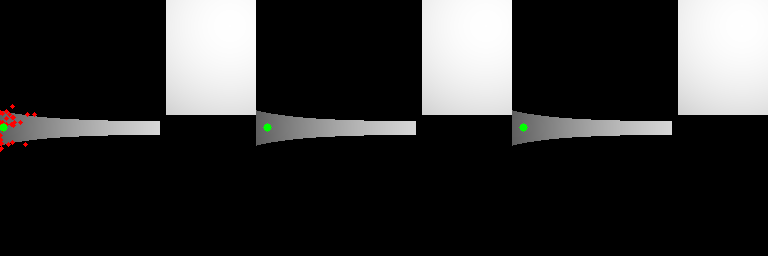
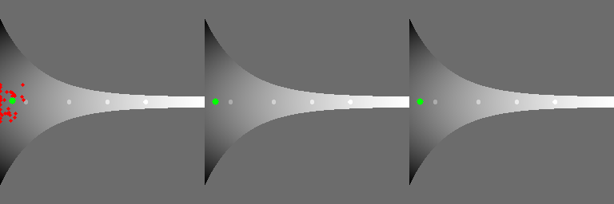

# Exploration of Evolutionary Strategy and Finite Differences

ES implemetation is taken from [here](https://github.com/Howuhh/evolution_strategies_openai/tree/8e9c369b5df94a4afeb6773f686fca1298a69285)

This project explores the different landscape that evolutionary strategy(ES) and finite differences (FD) can explore by combining them

Specifically:  
ES can 
**overcome**:
- gradient gaps
- local optima  

**suffers in**:
- narrow paths  

While FD can **overcome**
- narrow paths

but **suffers** in 
- gradient gaps
- local optima 

Combining them can traverse landscape that both ES and FD cannot solve individually:




To run a single experiment do:
```
python single_run_experiment.py
```
The results will be under the experiments directory  
To run all experiments do:
```
python all_run_experiments.py
```
results will be under presentation_exps directory


For details of ES and FD consult:
- [Evolution Strategies as a
Scalable Alternative to Reinforcement Learning](https://arxiv.org/pdf/1703.03864.pdf) (ES)
- [ES Is More Than Just a Traditional Finite-Difference
Approximator](https://arxiv.org/pdf/1712.06568.pdf) (FD)